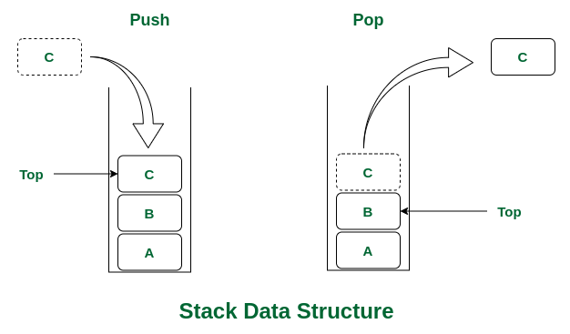
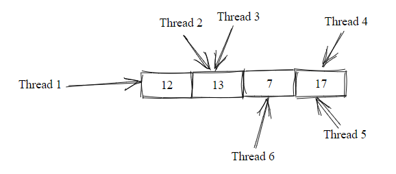
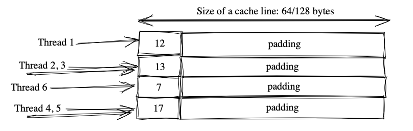
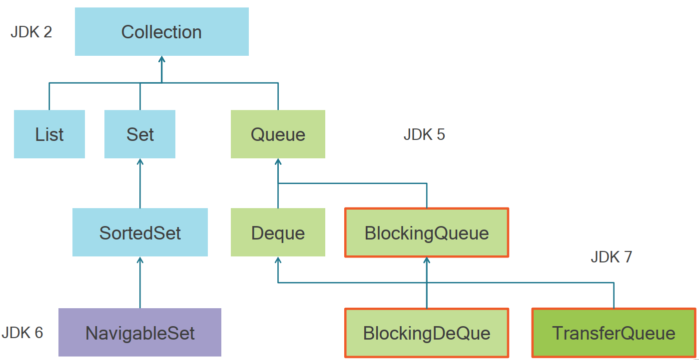
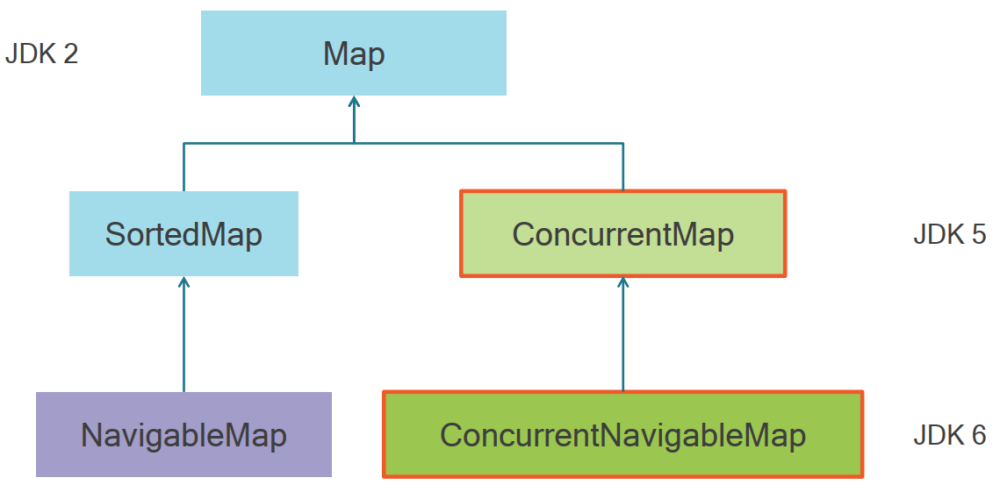
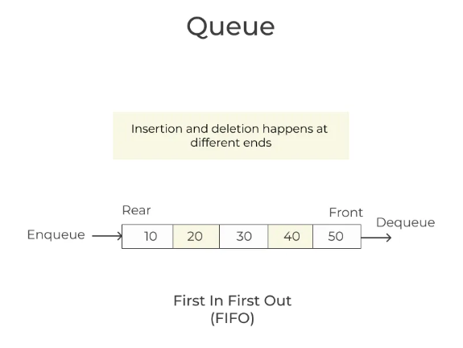
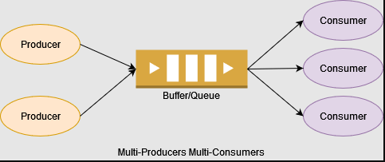

# Advanced Concurrency - Module 3

> This is a tutorials course covering advanced concurrency in Java.

Tools used:

- JDK 11
- Maven
- JUnit 5, Mockito
- IntelliJ IDE

## Table of contents

1. [CAS operation and Atomic classes](https://github.com/backstreetbrogrammer/34_AdvancedConcurrencyModule3#chapter-01-cas-operation-and-atomic-classes)
2. [Concurrent Collections](https://github.com/backstreetbrogrammer/34_AdvancedConcurrencyModule3#chapter-02-concurrent-collections)

---

### Chapter 01. CAS operation and Atomic classes

**Compare and Swap (CAS)** is a technique used when designing concurrent algorithms and are very low level
functionalities given by the CPU that are exposed at the API level (Package: `java.util.concurrent.atomic`) so that we
can use them in our applications.

The approach is to compare the **actual** value of the variable to the **expected** value of the variable and if the
**actual** value matches the **expected** value, then **swap** the **actual** value of the variable for the **new**
value passed in.

**Working of the Algorithm**

It is like we know that this variable should be `1`, and we want to change it to `2`.

Since this is a multithreaded environment, we know that others might be working on the same variable.

So we should first check if the value of the variable is `1` as we thought and if yes, then we change it to `2`.

If we see that the variable is `3` now, then that means someone else is working on it and so let us not touch it at this
time.

#### Interview Problem 1 (UBS): Explain cost of synchronization in Java and best practices for lock acquisition

The problem in concurrent programming is the concurrent access to **shared** memory. We used **synchronization** to
handle that. But in certain cases, we have **more** tools.

Synchronization can cause us a lot of trouble when they are not used thoughtfully.

As a general rule, we should synchronize only on objects that we are sure no **outside** code will lock.

In other words, it's a bad practice to use **pooled** or **reusable** objects for synchronization.

The reason is that a pooled or reusable object is accessible to other processes in the JVM, and any **modification** to
such objects by outside or untrusted code can result in a **deadlock** and **non-deterministic** behavior.

**Examples**:

- **String literals**

String literals are pooled and often reused in Java. Therefore, it's not advised to use the `String` literal type with
the `synchronized` keyword for synchronization:

```
private final String stringLock = "MY_LOCK";
public void stringBadPractice() {
    synchronized (stringLock) {
        // ...
    }
}
```

The `String` object is the most used class in the Java language.

Thus, Java has a **String Pool** — the special memory region where Strings are stored by the JVM.

Because Strings are **immutable**, the JVM can optimize the amount of memory allocated for them by storing only one copy
of each literal String in the pool. This process is called **interning**.

When we create a String variable and assign a value to it, the JVM searches the pool for a String of equal value. If
found, the Java compiler will simply return a reference to its memory address, without allocating additional memory.

Note: All String literals and string-valued constant expressions are automatically interned.

Before Java 7, the JVM placed the **Java String Pool** in the **PermGen** space, which has a fixed size — it can't be
expanded at runtime and is **not** eligible for garbage collection.

The risk of interning Strings in the **PermGen** (instead of the **Heap**) is that we can get an `OutOfMemory` error
from the JVM if we intern too many Strings.

From Java 7 onwards, the **Java String Pool** is stored in the **Heap** space, which is garbage collected by the JVM.
The advantage of this approach is the reduced risk of `OutOfMemory` error because unreferenced Strings will be removed
from the pool, thereby releasing memory.

The **solution** is to use String **object** rather than String literal:

```
private final String stringLock = new String("MY_LOCK");
public void stringSolution() {
    synchronized (stringLock) {
        // ...
    }
}
```

- **Wrapper classes** or **Boxed Primitive**

Similar to the `String` literals, boxed types may reuse the instance for some values. JVM caches and shares the value
that can be represented as a `byte`.

```
private int count = 0;
private final Integer intLock = count; 
public void boxedPrimitiveBadPractice() { 
    synchronized (intLock) {
        count++;
        // ... 
    } 
}
```

The **solution** is to create a new instance **object**:

```
private int count = 0;
private final Integer intLock = new Integer(count);
public void boxedPrimitiveSolution() {
    synchronized (intLock) {
        count++;
        // ...
    }
}
```

- **Boolean literals**

The `Boolean` type with its two values, `true` and `false`, is unsuitable for locking purposes. Similar to `String`
literals in the JVM, `boolean` literal values also share the unique instances of the `Boolean` class.

```
private final Boolean booleanLock = Boolean.FALSE;
public void booleanBadPractice() {
    synchronized (booleanLock) {
        // ...
    }
}
```

System can become unresponsive or result in a deadlock situation if any outside code also synchronizes on a `Boolean`
literal with the same value.

- **Using Class instance**

JVM uses the object itself as a monitor (its intrinsic lock) when a class implements method synchronization or block
synchronization with the `this` keyword.

Untrusted code can obtain and indefinitely hold the intrinsic lock of an accessible class. Consequently, this can result
in a deadlock situation.

It's recommended to synchronize on a **private final** instance of the `Object` class. Such an object will be
inaccessible to outside untrusted code that may otherwise interact with our public classes, thus reducing the
possibility that such interactions could result in deadlock.

```
private final Object objLock = new Object();
public void finalObjectLockSolution() {
    synchronized (objLock) {
        // ...
    }
}
```

Additionally, if a method that implements the synchronized block modifies a `static` variable, we must synchronize by
locking on the `static` object:

```
private static int staticCount = 0;
private static final Object staticObjLock = new Object();
public void staticVariableSolution() {
    synchronized (staticObjLock) {
        count++;
        // ...
    }
}
```

**Understanding CAS**

Then a thread enters the critical section blocked by synchronization - at that runtime, there is NO real
**concurrency**. Because only 1 thread is running at that time.

This is where **CAS** can be used.

**Compare and Swap** works with three parameters:

- a location in memory
- an **existing** value at that location
- a **new** value to **replace** this **existing** value

If the **current value** at that address is the **expected value**, then it is replaced by the **new value** and returns
`true`.

If not, it returns `false`

This is all done in a **single, atomic** assembly instruction.

**Example with `AtomicInteger`**:

```
        // Create an atomic integer
        final AtomicInteger counter = new AtomicInteger(10);
        // Safely increment the value
        final int newValue = counter.incrementAndGet();
```

This is a safe incrementation of a counter without synchronization.

Under the hood, the Java API **tries** to **apply** the incrementation.

The CASing tells the calling code if the incrementation **failed**.

If it did, the API **tries again**.

#### Interview Problem 2 (Barclays): Demonstrate CAS operation without using Java Atomic API

Demonstrate the Compare-And-Swap (CAS) operation using simple locks.

**Solution**:

First, lets implement a simulated CAS using locks:

```java
public class CASUsingLocks {

    private int value;

    public synchronized int get() {
        return value;
    }

    public synchronized int compareAndSwap(final int expectedValue, final int newValue) {
        final int oldValue = value;
        if (oldValue == expectedValue) {
            value = newValue;
        }
        return oldValue;
    }

    public synchronized boolean compareAndSet(final int expectedValue, final int newValue) {
        return expectedValue == compareAndSwap(expectedValue, newValue);
    }
}
```

Now, let's use it for implementation of a thread-safe counter.

```java
public class CounterUsingCAS {

    private final CASUsingLocks value = new CASUsingLocks();

    public int get() {
        return value.get();
    }

    public void increment() {
        int v;

        do {
            v = value.get();
        } while (v != value.compareAndSwap(v, v + 1));

    }
}
```

Unit Test class:

```java
import org.junit.jupiter.api.DisplayName;
import org.junit.jupiter.api.Test;

public class CounterUsingCASTest {

    @Test
    @DisplayName("Demonstrate thread safe counter using CAS")
    void demonstrateThreadSafeCounterUsingCAS() throws InterruptedException {
        final CounterUsingCAS counter = new CounterUsingCAS();
        final Runnable r = () -> {
            for (int i = 0; i < 1_000; i++) {
                counter.increment();
            }
        };

        final Thread[] threads = new Thread[1_000];
        for (int i = 0; i < threads.length; i++) {
            threads[i] = new Thread(r);
            threads[i].start();
        }

        for (int i = 0; i < threads.length; i++) {
            threads[i].join();
        }

        System.out.printf("Counter Value = %d%n", counter.get());
    }
}
```

Output will always be correct:

```
Counter Value = 1000000
```

#### Java Atomic API

**AtomicBoolean**

- get(), set()
- getAndSet(value)
- compareAndSet(expected, value)

**AtomicInteger**, **AtomicLong**

- get(), set()
- getAndSet(value)
- compareAndSet(expected, value)
- getAndUpdate(unaryOp), updateAndGet(unaryOp)
- getAndIncrement(), getAndDecrement()
- getAndAdd(value), addAndGet(value)
- getAndAccumulate(value, binOp), accumulateAndGet(value, binOp)

**AtomicReference<V>**

- get(), set()
- getAndSet(value)
- getAndUpdate(unaryOp), updateAndGet(unaryOp)
- getAndAccumulate(value, binOp), accumulateAndGet(value, binOp)
- compareAndSet(expected, value)

**Summary**

- CASing works well when concurrency is not "too" high
- CASing: many tries until it is accepted…
- CASing is different from synchronization and can lead to better performances
- Synchronization: waiting threads until one can enter the synchronized block
- CASing may create load on the memory and / or CPU

#### Interview Problem 3 (Goldman Sachs): Implement thread-safe concurrent Stack using CAS

A stack is a linear data structure that follows the LIFO - **Last-In, First-Out** principle. That means the objects can
be inserted or removed only at one end of it, also called a **top**. Last object inserted will be the first object to
get.



Implement a thread-safe concurrent Stack using CAS.

Following 3 methods should be implemented from the `StackI` interface.

```java
public interface StackI<T> {

    T pop();

    void push(T item);

    T peek();

}
```

**SOLUTION**

Let's create a `StackNode` first to be used in the concurrent stack.

```java
public class StackNode<T> {

    private T data;
    private StackNode<T> next;

    public StackNode(final T data) {
        this.data = data;
    }

    public T getData() {
        return data;
    }

    public void setData(final T data) {
        this.data = data;
    }

    public StackNode<T> getNext() {
        return next;
    }

    public void setNext(final StackNode<T> next) {
        this.next = next;
    }
}
```

Final `ConcurrentStackUsingCAS` implementation:

```java
import java.util.concurrent.atomic.AtomicReference;

public class ConcurrentStackUsingCAS<T> implements StackI<T> {
    private final AtomicReference<StackNode<T>> top = new AtomicReference<>();

    @Override
    public T pop() {
        StackNode<T> oldHead;
        StackNode<T> newHead;
        do {
            oldHead = top.get();
            if (oldHead == null) {
                return null;
            }
            newHead = oldHead.getNext();
        } while (!top.compareAndSet(oldHead, newHead));
        return oldHead.getData();
    }

    @Override
    public void push(final T item) {
        final StackNode<T> newHead = new StackNode<>(item);
        StackNode<T> oldHead;
        do {
            oldHead = top.get();
            newHead.setNext(oldHead);
        } while (!top.compareAndSet(oldHead, newHead));
    }

    @Override
    public T peek() {
        if (top.get() == null) {
            return null;
        }
        return top.get().getData();
    }
}
```

**Unit Test**

```java
import org.junit.jupiter.api.DisplayName;
import org.junit.jupiter.api.Test;

import java.util.concurrent.CountDownLatch;
import java.util.concurrent.TimeUnit;

import static org.junit.jupiter.api.Assertions.assertEquals;

public class ConcurrentStackUsingCASTest {

    private final ConcurrentStackUsingCAS<String> myStack = new ConcurrentStackUsingCAS<>();

    @Test
    @DisplayName("Test ConcurrentStack CAS implementation using single thread")
    void testConcurrentStackUsingCAS_SingleThreaded() {
        myStack.push("A");
        myStack.push("B");
        myStack.push("C");
        myStack.push("D");

        assertEquals("D", myStack.peek());
        assertEquals("D", myStack.pop());
        assertEquals("C", myStack.pop());
        assertEquals("B", myStack.peek());

        myStack.push("E");

        assertEquals("E", myStack.pop());
        assertEquals("B", myStack.peek());
    }

    @Test
    @DisplayName("Test ConcurrentStack CAS implementation using multiple threads")
    void testConcurrentStackUsingCAS_MultiThreaded() throws InterruptedException {
        final var latch = new CountDownLatch(2);
        final Thread thread1 = new Thread(() -> {
            myStack.push("A");
            myStack.push("B");
            myStack.push("C");
            myStack.push("D");
            myStack.push("E");
            myStack.push("F");
            latch.countDown();
        });
        thread1.start();
        TimeUnit.SECONDS.sleep(1L);

        final Thread thread2 = new Thread(() -> {
            myStack.pop(); // F
            latch.countDown();
        });
        thread2.start();

        latch.await();

        assertEquals("E", myStack.peek());
        assertEquals("E", myStack.pop());

        myStack.push("G");
        assertEquals("G", myStack.pop());
        assertEquals("D", myStack.peek());
    }
}
```

#### Adders and Accumulators introduced in Java 8

All the methods are built on the "modify and get" or "get and modify". Sometimes we do not need the "get" part at each
modification.

**Adders** and **Accumulators** are created to be very efficient in the multithreaded environment and both leverage very
clever tactics to be lock-free and still remain thread-safe.

They do not return the updated value - thus, it can distribute the update on different calls and merge the results on
a **get** call.

These are tailored for high concurrency. If there are few number of threads - it may not be that useful.

**Dynamic Striping**

All adder and accumulator implementations in Java are inheriting from base-class called `Striped64`.

Instead of using just one value to maintain the current state, this class uses an array of states to distribute the
contention to different memory locations.



Different threads are updating different memory locations. Since we're using an array (that is, stripes) of states, this
idea is called dynamic striping.

We expect dynamic striping to improve the overall performance. However, the way the JVM allocates these states may have
a counterproductive effect.

To be more specific, the JVM may allocate those states near each other in the heap. This means that a few states can
reside in the same CPU cache line. Therefore, updating one memory location may cause a cache miss to its nearby states.
This phenomenon, known as false sharing, will hurt the performance.

To prevent false sharing. the Striped64 implementation adds enough padding around each state to make sure that each
state resides in its own cache line:



The `@Contended` annotation is responsible for adding this padding. The padding improves performance at the expense of
more memory consumption.

*LongAdder**

API

- increment(), decrement()
- add(long)
- sum(), longValue(), intValue()
- sumThenReset()

Let's consider some logic that's incrementing some values very often, where using an `AtomicLong` can be a bottleneck.
This uses a CAS operation, which – under heavy contention – can lead to a lot of wasted CPU cycles.

`LongAdder` uses a very clever trick to reduce contention between threads, when these are incrementing it.

When we want to increment an instance of the `LongAdder`, we need to call the `increment()` method. That implementation
keeps an array of counters that can grow on demand.

When more threads are calling `increment()`, the array will be longer. Each record in the array can be updated
separately – thus, reducing the contention.

Due to that fact, the `LongAdder` is a very efficient way to increment a counter from multiple threads.

```java
import org.junit.jupiter.api.DisplayName;
import org.junit.jupiter.api.Test;

import java.util.concurrent.ExecutorService;
import java.util.concurrent.Executors;
import java.util.concurrent.TimeUnit;
import java.util.concurrent.atomic.LongAdder;
import java.util.stream.IntStream;

import static org.junit.jupiter.api.Assertions.assertEquals;

public class LongAdderTest {

    @Test
    @DisplayName("Test LongAdder demo")
    void testLongAdder() throws InterruptedException {
        final LongAdder counter = new LongAdder();
        final ExecutorService executorService = Executors.newFixedThreadPool(8);

        final int numberOfThreads = 4;
        final int numberOfIncrements = 100;

        final Runnable incrementAction = () -> IntStream
                .range(0, numberOfIncrements)
                .forEach(i -> counter.increment());

        for (int i = 0; i < numberOfThreads; i++) {
            executorService.execute(incrementAction);
        }

        TimeUnit.SECONDS.sleep(1L);

        assertEquals(counter.sum(), numberOfIncrements * numberOfThreads);
        assertEquals(counter.longValue(), numberOfIncrements * numberOfThreads);

        assertEquals(counter.sumThenReset(), numberOfIncrements * numberOfThreads);
        assertEquals(counter.sum(), 0);
    }
}
```

**LongAccumulator** - built on a binary operator

API

- accumulate(long)
- get()
- intValue(), longValue(), floatValue(), doubleValue()
- getThenReset()

`LongAccumulator` can be used to accumulate results according to the supplied `LongBinaryOperator` – this works
similarly to the `reduce()` operation from Stream API.

The instance of the `LongAccumulator` can be created by supplying the `LongBinaryOperator` and the initial value to its
constructor. The important thing to remember that LongAccumulator will work correctly if we supply it with a commutative
function where the **order of accumulation** does not matter.

```
final LongAccumulator accumulator = new LongAccumulator(Long::sum, 0L);
```

We are creating a `LongAccumulator` which will add a new value to the value that was already in the accumulator.

We are setting the initial value of the `LongAccumulator` to **zero**, so in the first call of the `accumulate()`
method, the `previousValue` will have a zero value.

Firstly, it executes an action defined as a `LongBinaryOperator`, and then it checks if the `previousValue` changed. If
it was changed, the action is executed again with the new value. If not, it succeeds in changing the value that is
stored in the accumulator.

```java
import org.junit.jupiter.api.DisplayName;
import org.junit.jupiter.api.Test;

import java.util.concurrent.ExecutorService;
import java.util.concurrent.Executors;
import java.util.concurrent.TimeUnit;
import java.util.concurrent.atomic.LongAccumulator;
import java.util.stream.IntStream;

import static org.junit.jupiter.api.Assertions.assertEquals;

public class LongAccumulatorTest {

    @Test
    @DisplayName("Test LongAccumulator demo")
    void testLongAccumulator() throws InterruptedException {
        final LongAccumulator accumulator = new LongAccumulator(Long::sum, 0L);
        final ExecutorService executorService = Executors.newFixedThreadPool(8);

        final int numberOfThreads = 4;
        final int numberOfIncrements = 100;

        final Runnable accumulateAction = () -> IntStream
                .rangeClosed(0, numberOfIncrements)
                .forEach(accumulator::accumulate);

        for (int i = 0; i < numberOfThreads; i++) {
            executorService.execute(accumulateAction);
        }

        TimeUnit.SECONDS.sleep(1L);

        assertEquals(accumulator.get(), 20200);
        assertEquals(accumulator.longValue(), 20200);
    }
}
```

---

### Chapter 02. Concurrent Collections

We will discuss concurrent **collections** and **maps** and their implementations.

- **Collections**: Queue, BlockingQueue
- **Map**: ConcurrentMap





#### Concurrent Lists

**Vector and Stack**

These legacy classes should not be used as these are poorly implemented. All the methods are synchronized - meaning that
no thread can read or write without holding the lock.

In modern applications - where we are dealing with 100s of threads - `Vector` and `Stack` classes will severely impact
the performance.

**Copy on Write**

Has the similar semantics as read-write lock, i.e. no locking is needed for **read** operations.

Whenever any **write** operation is done -> its done on the **copy** of the original list or set -> then the copy
replaces the original list or set **atomically** (using synchronization).

The iterator will not reflect additions, removals, or changes to the list since the iterator was created.

Main points:

- Exists for list and set = `CopyOnWriteArrayList`, `CopyOnWriteArraySet`
- No locking for read operations
- Write operations create a new structure
- The new structure then replaces the previous one
- Useful when the list or set is created once at the beginning of the application run and then only read operations are
  done from the list or set

**Queues and Stacks**

There are 2 kinds of queues:

- FIFO (First In, First Out) - **Queue**
  

- LIFO (Last In, First Out) - **Stack**
  

In JDK, we have 2 interfaces:

- `Queue`: queue
- `Deque`: both a queue and a stack (remember to NOT use `Stack` legacy class)

Concrete classes:

- `ArrayBlockingQueue`: a bounded blocking queue built on an array
- `ConcurrentLinkedQueue`: an unbounded blocking queue

We are in the multithreaded multicore CPU world, thus we can have many producers and consumers as we need.



Each of producers and consumers are in their own thread pools and a thread does not know how many elements are in the
queue.

2 conditions which we have emphasized before:

- What happens if the queue / stack is **full**, and we need to **add** an element to it?
- What happens if the queue / stack is **empty**, and we need to **get** an element from it?

**Adding an element at the tail of a Queue that is full**

```
boolean add(E e); // fail: IllegalArgumentException
```

```
// fail: return false
boolean offer(E e); 
boolean offer(E e, timeOut, timeUnit);
```

```
// blocks until a cell becomes available
void put(E e);
```

So there are 2 behaviors:

- Failing with an exception
- Failing and returning false

And for **blocking** queue:

- Blocking until the queue can accept the element

**Deque and BlockingDeque**

Deque can accept elements at the **head** of a queue:

- `addFirst()`
- `offerFirst()`

And for the BlockingDeque

- `putFirst()`

Other methods:

Queues have also **get** and **peek** operations

**Queue**:

- Returns null: `poll()` and `peek()`
- Exception: `remove()` and `element()`

**BlockingQueue**:

- blocks: `take()`

**Deque**:

- Returns null: `pollLast()` and `peekLast()`
- Exception: `removeLast()` and `getLast()`

**BlockingDeque**:

- blocks: `takeLast()`

To summarize,

- Four different types of queues (`Queue`, `BlockingQueue`, `Deque`, `BlockingDeque`): they may be blocking or not, may
  offer access from both sides or not
- Different types of failure: special value, exception, blocking

That makes the API quite complex, with a lot of methods.

#### BlockingQueue Deep Dive

We can distinguish two types of BlockingQueue:

- unbounded queue – can grow almost indefinitely
- bounded queue – with maximal capacity defined

**Unbounded Queue**

Example code snippet to create a blocking deque:

```
BlockingQueue<String> blockingQueue = new LinkedBlockingDeque<>();
```

The capacity of `blockingQueue` will be set to `Integer.MAX_VALUE`. All operations that add an element to the unbounded
queue will **NEVER** block, thus it could grow to a very large size.

Disadvantage is if consumers are not able to consume messages -> producers will keep on producing the item to the
unbounded queue causing memory issues or even `OutOfMemory` exception.

**Bounded Queue**

Just using the overloaded constructor and giving the capacity:

```
BlockingQueue<String> blockingQueue = new LinkedBlockingDeque<>(10); // capacity = 10
```

When a producer tries to add an element to an already full queue, depending on a method that was used to add it
(`offer()`, `add()` or `put()`), it will block until space for inserting object becomes available. Otherwise, the
operations will fail.

Using bounded queue is a good way to design concurrent programs because when we insert an element to an already full
queue, that operations need to wait until consumers catch up and make some space available in the queue. It gives us
**throttling** without any effort on our part.

**Adding Elements**

- **add()** – returns true if insertion was successful, otherwise throws an `IllegalStateException`
- **put()** – inserts the specified element into a queue, waiting for a free slot if necessary
- **offer()** – returns true if insertion was successful, otherwise false
- **offer(E e, long timeout, TimeUnit unit)** – tries to insert element into a queue and waits for an available slot
  within a specified timeout

**Retrieving Elements**

- **take()** – waits for a head element of a queue and removes it. If the queue is empty, it blocks and waits for an
  element to become available
- **poll(long timeout, TimeUnit unit)** – retrieves and removes the head of the queue, waiting up to the specified wait
  time if necessary for an element to become available. Returns null after a timeout

#### Interview Problem 4 (KBC Bank): Implement thread-safe blocking queue

Implement a simple thread-safe blocking queue using List or an array as a buffer.

**Solution**

```java
import java.util.LinkedList;
import java.util.List;
import java.util.concurrent.TimeUnit;
import java.util.concurrent.TimeoutException;
import java.util.concurrent.locks.Condition;
import java.util.concurrent.locks.Lock;
import java.util.concurrent.locks.ReentrantLock;

public class BlockingQueue<E> {
    private final List<E> queue = new LinkedList<>();
    private final int limit;

    private static final Lock lock = new ReentrantLock();
    private static final Condition notFull = lock.newCondition();
    private static final Condition notEmpty = lock.newCondition();

    public BlockingQueue(final int limit) {
        if (limit < 1) {
            throw new IllegalArgumentException("capacity can not be less than 1");
        }
        this.limit = limit;
    }

    public void enqueue(final E item) {
        try {
            lock.lock();
            while (isFull()) {
                if (!notFull.await(10, TimeUnit.MILLISECONDS)) {
                    throw new TimeoutException("Producer time out!");
                }
            }
            this.queue.add(item);
            notEmpty.signalAll();
        } catch (final InterruptedException | TimeoutException e) {
            e.printStackTrace();
        } finally {
            lock.unlock();
        }
    }

    public E dequeue() {
        try {
            lock.lock();
            while (isEmpty()) {
                if (!notEmpty.await(10, TimeUnit.MILLISECONDS)) {
                    throw new TimeoutException("Consumer time out!");
                }
            }
            final E item = this.queue.remove(0);
            notFull.signalAll();
            return item;
        } catch (final InterruptedException | TimeoutException e) {
            e.printStackTrace();
        } finally {
            lock.unlock();
        }
        return null;
    }

    private boolean isEmpty() {
        return this.queue.size() == 0;
    }

    private boolean isFull() {
        return this.queue.size() == this.limit;
    }

}
```

#### Interview Problem 5 (Point72 Hedge Fund): Demonstrate poison-pill in multithreaded producer-consumer pattern

Producers will be producing random String to a `BlockingQueue`.

We'll have multiple producer threads and use the `put()` method to block until there's space available in the queue.

The important thing to remember is that we need to stop our consumer threads from waiting for an element to appear in a
queue indefinitely.

A good technique to signal from producer to the consumer that there are no more messages to process is to send a special
message called a **poison pill**. We need to send as many poison pills as we have consumers. Then, when a consumer will
take that special poison pill message from a queue, it will finish execution gracefully.

**Solution**

`Producer` class to generate random String and put into BlockingQueue:

```java
import java.util.concurrent.BlockingQueue;
import java.util.concurrent.ThreadLocalRandom;

public class Producer implements Runnable {
    private final BlockingQueue<String> queue;
    private final String poisonPill;
    private final int poisonPillPerProducer;

    public Producer(final BlockingQueue<String> queue, final String poisonPill,
                    final int poisonPillPerProducer) {
        this.queue = queue;
        this.poisonPill = poisonPill;
        this.poisonPillPerProducer = poisonPillPerProducer;
    }

    @Override
    public void run() {
        try {
            for (int i = 0; i < 10; i++) {
                queue.put(randomString());
            }
            for (int j = 0; j < poisonPillPerProducer; j++) {
                queue.put(poisonPill);
                System.out.printf("[Producer-%s] Putting %s in the queue%n",
                                  Thread.currentThread().getName(), poisonPill);
            }
        } catch (final InterruptedException ie) {
            ie.printStackTrace();
            Thread.currentThread().interrupt();
        }
    }

    private String randomString() {
        final int leftLimit = 48; // numeral '0'
        final int rightLimit = 122; // letter 'z'
        final int targetStringLength = 10;

        return ThreadLocalRandom.current().ints(leftLimit, rightLimit + 1)
                                .filter(i -> (i <= 57 || i >= 65) && (i <= 90 || i >= 97))
                                .limit(targetStringLength)
                                .collect(StringBuilder::new, StringBuilder::appendCodePoint, StringBuilder::append)
                                .toString();
    }
}
```

`Consumer` class to consume from BlockingQueue and terminate if receives poison pill:

```java
import java.util.concurrent.BlockingQueue;

public class Consumer implements Runnable {
    private final BlockingQueue<String> queue;
    private final String poisonPill;

    public Consumer(final BlockingQueue<String> queue, final String poisonPill) {
        this.queue = queue;
        this.poisonPill = poisonPill;
    }

    @Override
    public void run() {
        try {
            while (true) {
                final String item = queue.take();
                if (item.equals(poisonPill)) {
                    System.out.printf("[Consumer-%s] Got %s - Terminating Gracefully :) %n",
                                      Thread.currentThread().getName(), poisonPill);
                    return;
                }
                System.out.printf("[Consumer-%s] consumed: %s%n", Thread.currentThread().getName(), item);
            }
        } catch (final InterruptedException e) {
            e.printStackTrace();
            Thread.currentThread().interrupt();
        }
    }
}
```

`PoisonPillDemo` class to demonstrate:

```java
import java.util.concurrent.BlockingQueue;
import java.util.concurrent.LinkedBlockingQueue;

public class PoisonPillDemo {

    public static void main(final String[] args) {
        final int BOUND = 10;
        final int N_PRODUCERS = 4;
        final int N_CONSUMERS = Runtime.getRuntime().availableProcessors();
        final String poisonPill = "POISON_PILL";
        final int poisonPillPerProducer = N_CONSUMERS / N_PRODUCERS;
        final int mod = N_CONSUMERS % N_PRODUCERS;

        final BlockingQueue<String> queue = new LinkedBlockingQueue<>(BOUND);

        System.out.printf(
                "No of producers:[%d], No of consumers:[%d], poison pill:[%s], poison pills per producer:[%d]%n",
                N_PRODUCERS, N_CONSUMERS, poisonPill, poisonPillPerProducer);
        System.out.println("-----------------------------");

        for (int i = 1; i < N_PRODUCERS; i++) {
            new Thread(new Producer(queue, poisonPill, poisonPillPerProducer)).start();
        }

        for (int j = 0; j < N_CONSUMERS; j++) {
            new Thread(new Consumer(queue, poisonPill)).start();
        }

        new Thread(new Producer(queue, poisonPill, poisonPillPerProducer + mod)).start();
    }

}
```

**Sample output:**

```
No of producers:[4], No of consumers:[4], poison pill:[POISON_PILL], poison pills per producer:[1]
-----------------------------
[Consumer-Thread-4] consumed: ZahHLACwmh
[Consumer-Thread-4] consumed: SUCAqAIcF2
[Consumer-Thread-4] consumed: vxYH8iq5DF
[Consumer-Thread-4] consumed: aA7tM3ZYku
[Consumer-Thread-4] consumed: z7ey10K9q7
[Consumer-Thread-4] consumed: 5Oy6zCt7gN
[Consumer-Thread-4] consumed: 7xcG60ZfDr
[Consumer-Thread-4] consumed: 4vnMdVA5bZ
[Consumer-Thread-4] consumed: y6zYoFq17D
[Consumer-Thread-4] consumed: o43fgRooJQ
[Consumer-Thread-4] consumed: lk7h0GeLMm
[Consumer-Thread-4] consumed: 8LpR7hp01R
[Consumer-Thread-4] consumed: 6dgcHnwz4i
[Consumer-Thread-4] consumed: RZBDMxpbmH
[Consumer-Thread-4] consumed: wI6Lllq3ZO
[Consumer-Thread-4] consumed: zfLzGhdTUL
[Consumer-Thread-4] consumed: FqafiZ5dU3
[Consumer-Thread-4] consumed: awGoxmdp9v
[Consumer-Thread-4] consumed: fQopQUDmRk
[Consumer-Thread-4] consumed: 0vNDyb24M7
[Consumer-Thread-4] consumed: U08Mgu4SXn
[Consumer-Thread-4] Got POISON_PILL - Terminating Gracefully :) 
[Consumer-Thread-3] consumed: 5tiDFu5eqb
[Consumer-Thread-3] consumed: cm9Ssp7s4d
[Consumer-Thread-3] consumed: Fi05V3EYcz
[Consumer-Thread-3] consumed: Lqvqiv218r
[Consumer-Thread-3] consumed: CNpNkQUpkW
[Consumer-Thread-3] consumed: ZGas4SMHbk
[Consumer-Thread-3] consumed: FtK6R6tNNZ
[Consumer-Thread-3] Got POISON_PILL - Terminating Gracefully :) 
[Consumer-Thread-6] consumed: Q8DlDYh3bC
[Consumer-Thread-6] consumed: vqWpVnx4yS
[Consumer-Thread-6] consumed: j9h1rPLW9n
[Consumer-Thread-6] consumed: 7YgyQwjetO
[Consumer-Thread-6] consumed: qoSgVD9yfE
[Consumer-Thread-6] consumed: uFkI6jCMMA
[Consumer-Thread-6] consumed: PfBqBe8duh
[Producer-Thread-1] Putting POISON_PILL in the queue
[Producer-Thread-7] Putting POISON_PILL in the queue
[Consumer-Thread-5] consumed: vzfqLqJID4
[Consumer-Thread-5] consumed: f1K0tnyLpG
[Consumer-Thread-5] consumed: m9q3sC2LbN
[Consumer-Thread-5] consumed: PqIGTBsweW
[Consumer-Thread-5] Got POISON_PILL - Terminating Gracefully :) 
[Producer-Thread-0] Putting POISON_PILL in the queue
[Consumer-Thread-6] consumed: h6S3o2Dq3N
[Producer-Thread-2] Putting POISON_PILL in the queue
[Consumer-Thread-6] Got POISON_PILL - Terminating Gracefully :) 
```

#### Concurrent Maps

One interface: `ConcurrentMap`

Two implementations:

- `ConcurrentHashMap`: JDK 7 & JDK 8
- `ConcurrentSkipListMap`: JDK 6, no synchronization


